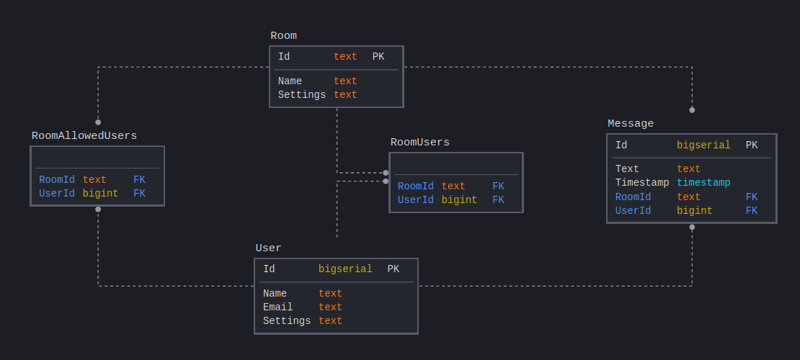

# Flix With Friends

# Sections:
1. [Installation](#user-content-installation)
2. [Socket.io events](#user-content-socketio-events)

---

# Installation

0. `git clone https://github.com/gpeppel/flix-with-friends.git`
1. Install your stuff!
```bash
npm install
pip install -r requirements.txt
```
2. If you already have psql set up, **SKIP THE REST OF THE STEPS AND JUST DO THE FOLLOWING COMMAND**:
`sudo service postgresql start`
3. Copy your `sql.env` file into your new directory.

## Setting up PSQL

1. Install PostgreSQL:
```bash
sudo yum install postgresql postgresql-server postgresql-devel postgresql-contrib postgresql-docs
```
2. Set up PostgreSQL:
```bash
sudo service postgresql initdb
sudo service postgresql start
sudo -u postgres createuser --superuser <username>
sudo -u postgres createdb <db name>
```
n a terminal, run `psql` and use these commands (replace username and password):
```
create user <username> superuser password '<password>';
\q
```
Create `sql.env` and put the username and password set above.
```bash
DATABASE_URI='postgresql://<username>:<password>@localhost/<db name>'
```

# Enabling read/write from SQLAlchemy
There's a special file that you need to enable your db admin password to work for:
1. Open the file in vim: `sudo vim /var/lib/pgsql9/data/pg_hba.conf`
If that doesn't work: `sudo vim $(psql -c "show hba_file;" | grep pg_hba.conf)`
2. Replace all values of `ident` with `md5` in Vim: `:%s/ident/md5/g`
3. After changing those lines, run `sudo service postgresql restart`
4. Ensure that `sql.env` has the username/password of the superuser you created!
5. Run your code!
  a) `npm run watch`. If prompted to install webpack-cli, type "yes"
  b) In a new terminal, `python app.py`
  c) Preview Running Application (might have to clear your cache by doing a hard refresh)

---

# Socketio Events
### message-new
*Server-to-Client*
Send new chat messages to clients

Data:
```
{
	"user": {
		"id": string,
		"name": string
	},
	"messages": [
		{
			"id": string,
			"text": string,
		}
	]
}
```
---
### message-send
*Client-to-Server*
Send a message to the server

Data:
```
{
	"text": string
}
```
---
### user-oauth-login-facebook
*Client-to-Server*
Login request

Data:
```
{

}
```

Callback data:
```
{
	"status": "ok" | "fail".
	"userId": string
}
```
---
### user-oauth-login-google
*Client-to-Server*
Login request

Data:
```
{
	"token": string,
	"username": string
}
```

Callback data:
```
{
	"status": "ok" | "fail",
	"userId": string
}
```
---
### user-join
*Server-to-Client*
New user has joined the room

Data:
```
{
	"user": {
		"id": string,
		"name": string
	}
}
```
---
### user-leave
*Server-to-Client*
User has left the room

Data:
```
{
	"user": {
		"id": string,
		"name": string
	}
}
```
---
### yt-load
*Client-to-Server, Server-to-Client*
Load the video info

Data:
```
{
	"height": int,
	"width": int,
	"videoId": string,
	"offset": int
}
```
---
### yt-state-change
*Client-to-Server, Server-to-Client*
Change the video state

Data:
```
{
	"state": "ready" | "play" | "pause" | "seek" | "sync",
	"offset": int,
	"timestamp": int,
	"runAt": int
}
```

---

# Database

