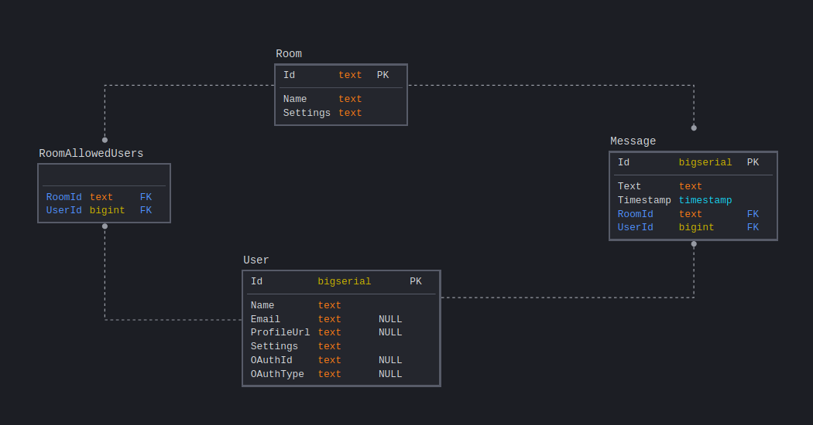

# Heroku Link:
[Flix With Friends](https://flix-with-friends.herokuapp.com/)
# Flix With Friends


Watch videos with friends at the same time remotely!

# Sections:
1. [Installation](#user-content-installation)
2. [Socket.io Events](#user-content-socketio-events)
3. [Database Schema](#user-content-database-schema)

---

# Installation

0. `git clone https://github.com/gpeppel/flix-with-friends.git`
1. Install requirements
```bash
npm install
pip install -r requirements.txt
```

## Setting up PSQL

1. Install PostgreSQL:
```bash
sudo yum install postgresql postgresql-server postgresql-devel postgresql-contrib postgresql-docs
```
2. Set up PostgreSQL:
```bash
sudo service postgresql initdb
sudo service postgresql start
sudo -u postgres createuser --superuser <username>
sudo -u postgres createdb <db name>
```
n a terminal, run `psql` and use these commands (replace username and password):
```
create user <username> superuser password '<password>';
\q
```
Create `sql.env` and put the username and password set above.
```bash
DATABASE_URI='postgresql://<username>:<password>@localhost/<db name>'
```

---

Run code:
`npm run build && python app.py`

---

# Socketio Events
### message-new
*Server-to-Client*
Send new chat messages to clients

Data:
```
{
    "messages": [
        {
            "id": string,
            "text": string,
            "user": {
                "id": string,
                "name": string
            },
            "timestamp": int
        }
    ]
}
```
---
### message-send
*Client-to-Server*

Send a message to the server

Data:
```
{
	"text": string
}
```
---
### user-oauth-login-facebook
*Client-to-Server*

Login request

Data:
```
{

}
```

Callback data:
```
{
	"status": "ok" | "fail".
	"userId": string
}
```
---
### user-oauth-login-google
*Client-to-Server*

Login request

Data:
```
{
	"token": string,
	"username": string
}
```

Callback data:
```
{
	"status": "ok" | "fail",
	"userId": string
}
```
---
### user-join
*Server-to-Client*

New user has joined the room

Data:
```
{
	"user": {
		"id": string,
		"name": string
	}
}
```
---
### user-leave
*Server-to-Client*

User has left the room

Data:
```
{
	"user": {
		"id": string,
		"name": string
	}
}
```
---
### yt-load
*Client-to-Server, Server-to-Client*

Load the video info

Data:
```
{
	"height": int,
	"width": int,
	"videoId": string,
	"offset": int
}
```
---
### yt-state-change
*Client-to-Server, Server-to-Client*

Change the video state

Data:
```
{
	"state": "ready" | "unstarted" | "ended" | "playing" | "paused" | "buffering" | "cued" | "playback",
	"sender": string,
	"offset": float,
	"rate": float,
	"runAt": int,
	"timestamp": string
}
```

---

# Database Schema


# Individualized Work Information
Avkash Patel:
Worked on setting up the viewing room  
Made room URL a sharable link through a copy button
Was unable to create multiple individualized rooms, so user story was moved to Sprint 2
Helped with styling for login page and viewing room
Changed logic so that viewing room creation is only possible if Facebook login is passed

